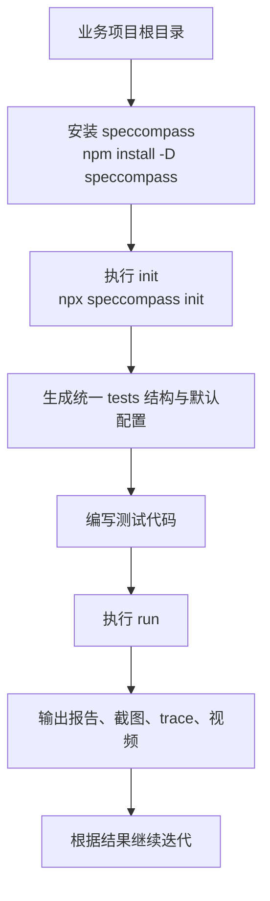

# Usage Guide

## 适用场景

本向导适用于把 `speccompass` 作为 npm 开发依赖接入任意业务项目，用来快速建立统一的 `Vitest + Playwright` 测试工作区。

推荐把它理解成：

- 一个负责 `init` 和 `run` 的小工具内核
- 一个给 skill 和 agent 提供稳定工作区的测试基础设施

## 推荐流程



## 接入步骤

### 1. 安装 `speccompass`

在业务项目根目录执行：

```bash
npm install -D speccompass vitest playwright
```

宿主项目需要自己安装 `vitest` 和 `playwright`。`speccompass` 负责初始化和执行流程，不会代替宿主项目提供测试框架本体。

### 2. 初始化测试工作区

回到业务项目根目录执行：

```bash
npx speccompass init
```

执行后会自动创建：

- `tests/testing.config.ts`
- `tests/unit`
- `tests/e2e`
- `vitest.speccompass.config.ts`
- `playwright.speccompass.config.ts`
- `package.json` 中的 `test:auto*` 脚本

### 3. 生成测试代码

推荐由 skill 或 agent 根据项目结构生成和补充：

- `tests/unit/**/*.test.ts`
- `tests/e2e/**/*.spec.ts`

### 4. 执行测试

初始化完成后，可以直接运行：

```bash
npm run test:auto
```

也可以直接使用 CLI：

```bash
npx speccompass run
```

## 初始化后的目录示意

```text
your-project/
  src/
  tests/
    testing.config.ts
    unit/
    e2e/
  test-results/
  vitest.speccompass.config.ts
  playwright.speccompass.config.ts
  package.json
```

## 结果输出

测试完成后，结果默认输出到业务项目根目录的 `test-results/`：

- `test-results/speccompass-report.txt`
- `test-results/speccompass-report.json`

如果 Playwright 运行中生成了截图、trace、视频等产物，默认输出到：

- `.speccompass/artifacts/`

这些产物的价值不仅是人读报告，也方便 agent 在后续回合继续消费。

## 常用命令

```bash
npx speccompass init
npx speccompass run
```

如果初始化命令已经写入脚本，也可以使用：

```bash
npm run test:auto
npm run test:auto:init
```

## 默认配置示例

```ts
export default {
  name: 'resultprocessing',
  baseURL: 'http://localhost:3000',
  vitest: {
    include: ['tests/unit/**/*.test.ts'],
  },
  playwright: {
    testDir: 'tests/e2e',
    headless: true,
    trace: 'on-first-retry',
  },
  artifacts: {
    outputDir: '.speccompass/artifacts',
    screenshot: 'only-on-failure',
    video: 'retain-on-failure',
    trace: 'on-first-retry',
  },
  results: {
    outputDir: 'test-results',
  },
};
```
